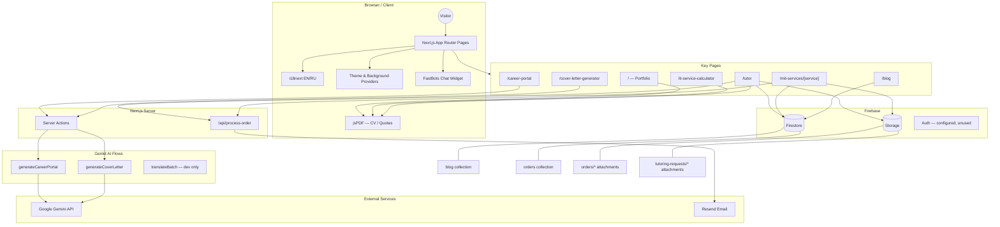
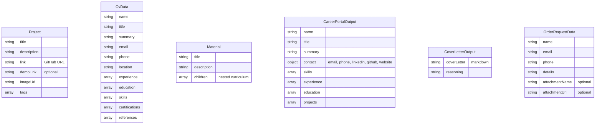
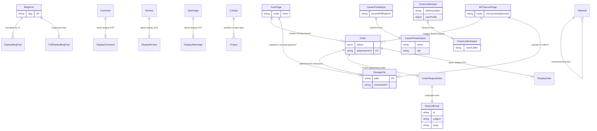
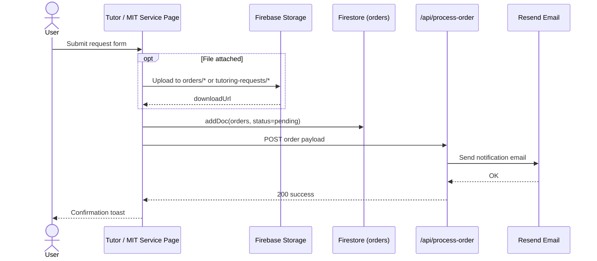

# MuzoInTech — Professional Portfolio

A modern, high-performance personal portfolio website built with **Next.js 15**, **TypeScript**, and **Firebase**. The platform showcases technical expertise, professional projects, and educational milestones with AI-powered tools, bilingual support, and precision PDF generation.

## Core Features

- **Dynamic CV Generation** — High-precision PDF resumes via `jsPDF`, with specialized templates for technical and tutoring roles.
- **IT Service Calculator** — Interactive project cost estimator for web, software, and AI services with real-time USD/ZMW conversion and PDF quote export.
- **AI Career Portal** — Upload a resume PDF and generate a structured personal landing page using Genkit (Gemini).
- **AI Cover Letter Generator** — Tailored cover letters from job descriptions, aligned to a professional profile.
- **Blog System** — Firestore-backed blog with slug-based routing and image support.
- **MIT Services & Tutoring** — Service detail pages and tutoring requests with optional file uploads, Firestore persistence, and email notifications.
- **Bilingual UI** — English/Russian localization via `i18next` and static locale files.
- **Premium UI/UX** — Responsive Tailwind CSS + Shadcn UI, Framer Motion animations, dynamic background themes, and a floating calculator CTA.
- **FastBots Chat** — Embedded AI chat widget for visitor engagement.

## Tech Stack

| Layer | Technologies |
|-------|-------------|
| **Framework** | Next.js 15 (App Router), TypeScript |
| **UI** | Tailwind CSS, Shadcn UI, Framer Motion, Lucide icons |
| **Backend** | Firebase Firestore, Firebase Storage |
| **AI** | Genkit + Google Gemini (`gemini-flash-latest`) |
| **Email** | Resend (order notifications via `/api/process-order`) |
| **Localization** | i18next, react-i18next |
| **PDF** | jsPDF |
| **Deployment** | Netlify |

## Routes

| Route | Description |
|-------|-------------|
| `/` | Portfolio home — hero, projects, skills, experience, contact |
| `/blog` | Blog index |
| `/blog/[slug]` | Single blog post |
| `/tutor` | Tutoring page, CV download, request form |
| `/career-portal` | AI resume → career portal (ephemeral output) |
| `/cover-letter-generator` | AI cover letter generator |
| `/it-service-calculator` | Service cost calculator + PDF quote |
| `/products` | Product catalog linking to tools |
| `/projects` | Full project showcase |
| `/mit-services/[service]` | MIT service detail + order form |
| `/software-engineering` | Software engineering showcase |

**MIT service slugs:** `ai-consultation`, `web-development`, `app-development`, `system-development`, `networking`, `cybersecurity`

---

## System Architecture



---

## Entity Model (EML)

The diagrams below document every data entity in the project — persisted (Firestore/Storage), planned/legacy types, static portfolio data, and ephemeral AI outputs.

### Persisted Entities (Firestore & Storage)

```mermaid
erDiagram
    BlogPost {
        string id PK "Firestore doc ID"
        string title
        string slug UK "URL slug"
        string content
        string author
        timestamp publishedDate
        string imageUrl
        string imageHint "Alt / AI hint"
    }

    Order {
        string id PK "Firestore doc ID"
        string name
        string email
        string phone
        string details "TUTORING or SERVICE REQUEST"
        enum status "pending | in-progress | completed | cancelled"
        string attachmentName "nullable"
        string attachmentUrl "nullable — Storage URL"
        timestamp timestamp
        string userId "nullable — auth unused"
    }

    Comment {
        string id PK "planned / legacy"
        string name
        string email "optional"
        string comment "optional"
        timestamp timestamp
        string userId "nullable"
    }

    Review {
        string id PK "planned / legacy"
        string name
        string review "optional"
        int rating "1–5"
        timestamp timestamp
        string userId "nullable"
    }

    SiteImage {
        string id PK "planned / legacy"
        string section "e.g. affiliate_gallery"
        string imageUrl
        string alt
        string storagePath "optional"
        timestamp timestamp
    }

    StorageFile {
        string path PK "orders/* or tutoring-requests/*"
        string downloadUrl
        string originalName
        timestamp uploadedAt
    }
```



### Application & AI Entities (Static / Ephemeral)



---

## Entity Relationship Diagram (ERD)



### Order Submission Flow



---

## External Integrations

| Service | Purpose | Configuration |
|---------|---------|---------------|
| **Firebase Firestore** | Blog posts, service/tutoring orders | `NEXT_PUBLIC_FIREBASE_*` |
| **Firebase Storage** | Order & tutoring file attachments | `NEXT_PUBLIC_FIREBASE_*` |
| **Google Gemini** | Career portal, cover letter AI | `GOOGLE_GENAI_API_KEY` |
| **Resend** | Order notification emails | `RESEND_API_KEY`, `EMAIL_*_TEMPLATE` |
| **FastBots.ai** | Embedded chat widget | `data-bot-id` in `layout.tsx` |
| **i18next** | EN/RU UI translations | `src/i18n/locales/*.json` |

> **Note:** Firebase Auth is initialized but not used in the app. The `translateBatch` Genkit flow is available for development (`npm run genkit:dev`) but the live UI uses static i18next locale files.

---

## Getting Started

1. **Clone the repository**
   ```bash
   git clone <repository-url>
   cd muzoprof
   ```

2. **Configure environment variables** — create a `.env` file in the project root:
   ```env
   GOOGLE_GENAI_API_KEY=          # Gemini AI flows
   NEXT_PUBLIC_FIREBASE_API_KEY=
   NEXT_PUBLIC_FIREBASE_AUTH_DOMAIN=
   NEXT_PUBLIC_FIREBASE_PROJECT_ID=
   NEXT_PUBLIC_FIREBASE_STORAGE_BUCKET=
   NEXT_PUBLIC_FIREBASE_MESSAGING_SENDER_ID=
   NEXT_PUBLIC_FIREBASE_APP_ID=
   RESEND_API_KEY=                # Order email notifications
   EMAIL_SUBJECT_TEMPLATE=        # Optional email template
   EMAIL_BODY_TEMPLATE=           # Optional email template
   ```

3. **Install dependencies**
   ```bash
   npm install
   ```

4. **Run the development server**
   ```bash
   npm run dev
   ```

5. **Optional — Genkit AI dev UI**
   ```bash
   npm run genkit:dev
   ```

## Project Structure

```
src/
├── app/                    # Next.js App Router pages, layouts, API routes
│   ├── api/process-order/  # Resend email notification endpoint
│   ├── blog/               # Blog index + [slug] pages
│   ├── career-portal/      # AI resume portal
│   ├── components/         # App-level components (floating CTA, nav, etc.)
│   ├── cover-letter-generator/
│   ├── it-service-calculator/
│   ├── mit-services/       # Dynamic service pages
│   ├── products/
│   ├── projects/
│   ├── software-engineering/
│   └── tutor/
├── ai/                     # Genkit flows, types, and dev entry
│   └── flows/
├── components/             # Shared UI components (Shadcn)
├── data/                   # Static portfolio & CV data
├── i18n/                   # i18next config and locale files (EN/RU)
└── lib/                    # Firebase config, types, utilities
```

## Scripts

| Command | Description |
|---------|-------------|
| `npm run dev` | Start Next.js dev server |
| `npm run build` | Production build |
| `npm run start` | Start production server |
| `npm run lint` | ESLint |
| `npm run typecheck` | TypeScript check |
| `npm run genkit:dev` | Genkit AI development UI |

## License

© 2026 Musonda Salimu. All Rights Reserved.
