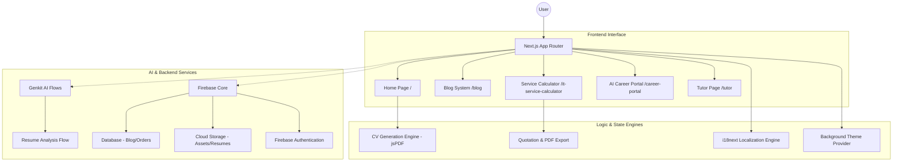

# MuzoInTech - Professional Portfolio

A modern, high-performance personal portfolio website built with Next.js, React, and Firebase. This platform showcases technical expertise, professional projects, and educational milestones with a focus on AI integration and precision engineering.

## Core Features

- **Dynamic CV Generation**: High-precision PDF generation engine (`jsPDF`) for professional resumes, supporting specialized templates for both Technical and Tutoring roles.
- **IT Service Calculator**: Interactive tool for project cost estimation across web, software, and AI services with real-time currency conversion (USD/ZMW) and PDF quote export.
- **Bilingual Support**: Comprehensive multi-language support (English/Russian) implemented via `i18next` for a seamless global experience.
- **AI Career Portal**: Intelligent resume analysis flow that transforms PDF uploads into structured personal landing pages using Genkit AI.
- **Premium UI/UX**: Responsive design built with Tailwind CSS and Shadcn UI, featuring dynamic background themes like "Neural Network" and the custom "Nebula" drift.

## Tech Stack

- **Framework**: Next.js 15 (App Router)
- **Language**: TypeScript
- **Styling**: Tailwind CSS, Shadcn UI, Framer Motion (animations)
- **Backend**: Firebase (Firestore, Storage, Authentication)
- **AI Integration**: Genkit (Google AI / Gemini)
- **Localization**: i18next & react-i18next
- **PDF Engine**: jsPDF

## Project Architecture



## Getting Started

1. **Clone the repository.**
2. **Configure Environment Variables**:
   Create a `.env` file in the root directory:
   - `GOOGLE_GENAI_API_KEY`: For AI analysis and translation.
   - `NEXT_PUBLIC_FIREBASE_API_KEY`: For client-side Firebase access.
   - `RESEND_API_KEY`: For project request email notifications.
3. **Install Dependencies**:
   ```bash
   npm install
   ```
4. **Launch Development Server**:
   ```bash
   npm run dev
   ```

## Project Structure

- `src/app`: Next.js App Router pages and layouts.
- `src/ai`: Genkit AI flow definitions and prompts.
- `src/i18n`: Localization resource files (EN/RU).
- `src/components`: Reusable UI components and specialized icons.
- `src/lib`: Firebase configuration and shared TypeScript types.

## License

© 2026 Musonda Salimu. All Rights Reserved.
