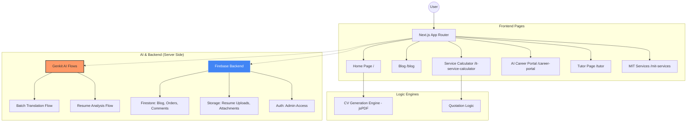

# Bilingual AI Personal Website (MuzoInTech)

## About Me (Project AIM)

This project is a dynamic and interactive personal portfolio website. I am Musonda Salimu, an IT Professional, Software Developer, and AI Enthusiast. This platform is designed to showcase a comprehensive overview of my technical skills, professional projects, and educational journey.

Key features of this website include:
-   **AI-Powered Translations**: The entire site supports real-time translation (English/Russian) powered by Google's Gemini Pro via Genkit.
-   **Dynamic CV Generation**: A high-precision PDF engine allows visitors to download or preview a professionally formatted 3-page CV instantly.
-   **Service Calculator**: An interactive tool for clients to estimate project costs for web, software, and AI development.
-   **AI Career Portal**: A feature that parses uploaded PDF resumes to create personalized landing pages.

## Project Structure

The following diagram illustrates the high-level architecture and routing of the application:

## Technologies Used

- **Next.js 15 (App Router)**: The core framework for server-side rendering and client-side interactivity.
- **TypeScript**: Ensuring type safety across complex data structures like CV models and translation queues.
- **Genkit (Google AI)**: Orchestrating LLM flows for batch translation and resume parsing.
- **Tailwind CSS & Shadcn UI**: Providing a modern, responsive, and accessible user interface.
- **Firebase**: Managing the database (Firestore), file storage (Storage), and serverless functions.
- **jsPDF**: A client-side library for high-precision PDF document generation.

## Environment Variables

To run this project, you will need to add the following environment variables to your `.env` file:

`GOOGLE_GENAI_API_KEY`: Your API key for Google's Generative AI.
`NEXT_PUBLIC_FIREBASE_API_KEY`: Your Firebase client configuration.
`RESEND_API_KEY`: For handling email notifications on project requests.

## Live Version

You can view the live version of this project at: [https://tinyurl.com/muzoslim](https://tinyurl.com/muzoslim)