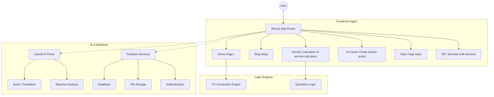

# MuzoInTech - Professional Portfolio

A modern, high-performance personal portfolio website built with Next.js, React, and Firebase. This platform showcases technical expertise, professional projects, and educational milestones.

## Core Features

- **Dynamic CV Generation**: High-precision PDF generation engine for professional resumes.
- **IT Service Calculator**: Interactive tool for project cost estimation across web, software, and AI services.
- **Bilingual Support**: Real-time language translation capabilities (English/Russian) via Gemini Pro.
- **AI Career Portal**: Resume analysis flow that transforms PDF uploads into personalized landing pages.
- **Modern UI/UX**: Responsive design built with Tailwind CSS, Shadcn UI, and dynamic background themes.

## Tech Stack

- **Framework**: Next.js 15 (App Router)
- **Language**: TypeScript
- **Styling**: Tailwind CSS, Shadcn UI
- **Backend**: Firebase (Firestore, Storage, Authentication)
- **AI Integration**: Genkit (Google AI)
- **PDF Engine**: jsPDF

## Getting Started

1. Clone the repository.
2. Set up environment variables in a `.env` file:
   - `GOOGLE_GENAI_API_KEY`
   - `NEXT_PUBLIC_FIREBASE_API_KEY`
   - `RESEND_API_KEY`
3. Install dependencies:
   ```bash
   npm install
   ```
4. Start the development server:
   ```bash
   npm run dev
   ```

## Project Architecture



## License

© 2026 Musonda Salimu. All Rights Reserved.
